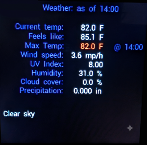
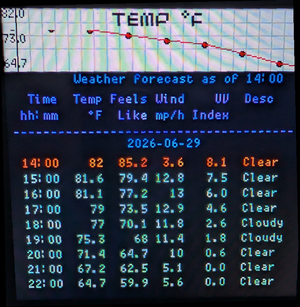
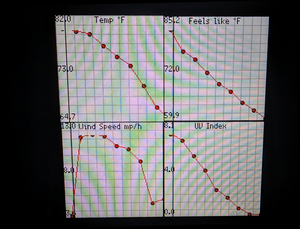
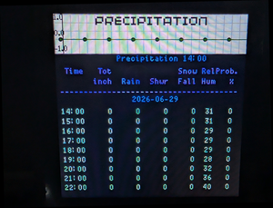
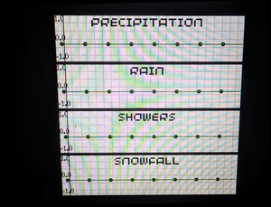
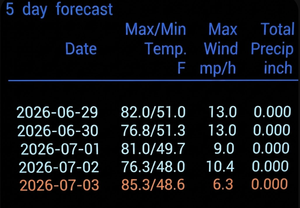
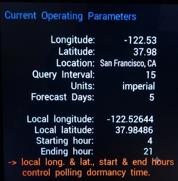
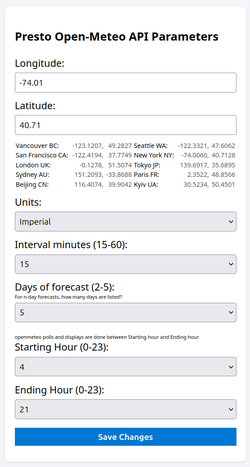

# Openmeteo Weather on the Pimoroni Presto

## Description

This micropython application polls https://api.open-meteo.com to get the forecast for a given latitude and longitude. Through a json configuration file the user can specify their wifi SSID and password, the frequency of polling, the longitude and latitude, units (metric/imperial) and the number of days of forecast data. There is a web page that can be used to change parameters while the app is running.

There are seven screens of displayable data accessible by swiping left and right:

* Current weather. Includes: temperature, UV index, wind speed, precipitation data.

<div align=center>

</div>

* Hourly list of forecast data: Temperature, wind speed, UV Index and a brief description of the weather (clear, cloudy, foggy, rain, ...).
  
<div align=center>

</div>

* chart showing trend of hourly temperatures.
<div align=center>

</div

* Hourly list of precipitation forecast: Temperature, total precipitation amount, relative humidity and probability of precipitation.

<div align=center>

</div>

* Chart showing trend of hourly precipitation.

<div align=center>

</div>

* Three to five day forecast of maximum daily temperature, maximum daily windspeed and total precipitation.

<div align=center>

</div>

* The current parameters controlling program operation.

<div align=center>

</div>
## Modules

### main.py

The driver of the application. After initialization; main.py permanently iterates, polling Open-Meteo according to the user specified frequency of polling. Note that this is coded as a stand-alone application and will replace the sample application that comes with the Pimoroni Presto. You can use the Thonny IDE to download the pimoroni code if you wish to save it. Or you can move it to a new directory on the RP2350.

### control.py

Sets the default control variables and then loads the config.json parameters to get the user's desired values for those variables.

### openmeteo.py

Issues the Open-Meteo API forecast query and formats the display.

### display_functions.py

Handles the Presto screen vector IO.

### config.json

This is the persistant set of operating parameters.

### 📦 Included Dependencies: Vendor_Code/pichart.py

This project bundles a modified version of https://github.com/kevinmcaleer/pichart, created by Kevin McAleer, which is licensed under the MIT License.

**Changes made:**

* Modified `pichart.py` to fix upper values missing from Y-axis on charts so it works seamlessly with this application.
  
* The modified source is included in the `Vendor_Code` directory, so you do not need to download it separately.The two chart screens are generated using this module.  See the customization section for notes on the minor change to this code for the Presto.

## Customization

Copy config.json.base to config.json. Then modify config.json as follows:

* QUERY_INTERVAL_MINUTES = _15_

    The app polls the Open-Meteo API server once every QUERY_INTERVAL_MINUTES. The validation code in control.py ensures that this is an integer value. If the DEBUG parameter,specified in config.json, is __false__ then QUERY_INTERVAL_MINUTES has a minimum value of 15. However, if the DEBUG value is __true__, then QUERY_INTERVAL_MINUTES has a minimum value of 1.

  * There is a limit of 10000 polls a day in the free API.
  * Open-Meteo data is only updated once every 15 minutes in _hourly_ mode.

* DEBUG = _true_

    When set to __false__, debugging statements are printed by a single routine, log_debug(), that is defined in control.py. DEBUG value __true__ can also be used by the developer to add additional debugging output as required. Should be set to __false__ for the final run-time, but there is no harm in leaving this __true__ as the lack of a terminal for output does not impact the program.  log_debug() outputs nothing if:
  * DEBUG is false _OR_
  * it is determined that the program is not running through an IDE. When the Presto runs without a terminal to receive the print statements, the RP2350 cache can fill up and slow or stop program execution. In control.py:

    ```python
    # RP2040 and RP2350 USB Controller base address + SIE\_STATUS offset
    SIE_STATUS_REG = 0x50110000 + 0x50

    # Bit definitions for the SIE status
    # Bit 16 (0x10000): Device is connected to a host (handshake completed)
    # Bit 4  (0x10): Device is suspended by the host (PC went to sleep or dropped terminal)
    SIE_CONNECTED = 1 << 16
    SIE_SUSPENDED = 1 << 4

    def is_usb_connected():
        #Reads the hardware register to check if an active USB host is connected."""
        try:
            status = machine.mem32[SIE_STATUS_REG]
        # It must be connected, and NOT suspended by the OS host
            return (status & (SIE_CONNECTED | SIE_SUSPENDED)) == SIE_CONNECTED
        except:
            # Absolute fallback to ensure the app never crashes under power anomalies
            return False

    def log_debug(msg):
        DEBUG = settings.get("DEBUG", False)
        
        if not DEBUG:
            return
        
        # Check the physical hardware before pushing to the serial buffer
        if is_usb_connected():
            print(f"DEBUG: {msg}")
    ```


* END_HOUR = _21_

    If the current, local, time is after the specified hour, then the app will become dormant. During these hours, the screen is dimmed and no polling is done. The app can be awakened by tapping or swiping the screen.

* START_HOUR = _4_

    The app will be active between this hour and END_HOUR.

START_HOUR and END_HOUR are on a 24 hour clock. If START_HOUR is greater than END_HOUR, END_HOUR is assumed to be on the next day from START_HOUR. Thus START_HOUR = 16 END_HOUR = 4 would run from 16:00 on day one to 04:00 the next day.

* LONGITUDE, LATITUDE

    The longitude and latitude to be used for the Open-meteo weather queries.

* LOCAL_LONGITUDE, LOCAL_LATITUDE

    These are used to determine the local time, which may be different from the time at the specified LONGITUDE and LATITUDE. Local time is used to check if the app is running within the START_HOUR and END_HOUR. 

* TIMEZONE = "auto"

    If TIMEZONE is set to __auto__, Open-Meteometeo will automatically determine the timezone at the specified LONGITUDE and LATITUDE. It is possible to hard-code these, such as TIMEZONE="America/New_York" or TIMEZONE="Europe/Berlin". See the Open-Meteo API docs for details.

* UNITS = "imperial"  # imperial / metric

    Use "imperial" for Fahrenheit/mph/inches. Use "metric" for Celsius/mps/mm.

* N_DAY_FORECAST = _5_

    specify a value of 3,4 or 5. This is how many days of forecast will be displayed on the multi-day forecast screen

* OPEN_STREETMAP_AGENT = _APPNAME/VERSION (email address or website url)_

    The Nominatim API for Open Streetmap is queried to determine the name of the location for LOCAL_LONGITUDE and LOCAL_LATITUDE. Nominatim requires an agent ID in the specified format. The email address or the website url must be valid. An example of a valid agent is: "OpenMeteo Weather Poller/V1 (me@gmail.com)" (assumes me@gmail.com is valid).
  * Does the user agent have to contain identifying information, such as the e-mail address?
    <p>According to Nominatim's strict official usage policy, yes, it should ideally contain a way to contact you.
    While their server won't programmatically read your string and parse whether it's a real email address, their policy explicitly states that the User-Agent must be set to a "valid contact description." </p>

  * Why do they require it?

    <p>Here is why they want this, how to handle it safely, and an alternative if you don't want to expose your personal details. Nominatim is a free, community-funded service run on donated hardware. If your script accidentally goes haywire (e.g., gets stuck in an infinite loop and bombards their servers with thousands of requests), system administrators look at the logs. If there is an email: They will often email you to ask you to fix the bug. If it's anonymous or generic: They will simply block your entire IP address or IP range from accessing the service completely.</p>

* Colors:
  * TITLE_COLOR = <span style="color:#4169E1;">\_RoyalBlue</span>
  * CHART_DATA_COLOR_TEMP = <span style="color:#FF0000;">\_Red</span>
  * CHART_DATA_COLOR_PRECIP = <span style="color:#00FF00;">\_Green</span>
  * CHART_GRID_COLOR = <span style="color:#D3D3D3;">\_LightGray</span>
  * CHART_BACKGROUND_COLOR = <span style="color:#ffffff;">\_White</span>
  * TABLE_HEADER_COLOR = <span style="color:#6A5ACD;">\_SlateBlue</span>
  * TABLE_NORMAL_TEXT_COLOR = <span style="color:#AFEEEE;">\_PaleTurquoise</span>
  * TABLE_ALERT_TEXT_COLOR = <span style="color:#FF7F50;">\_Coral</span>
  * TABLE_BACKGROUND_COLOR = \_Black
  <br>The module _display_functions.py_ contains a dictionary of RGB color specifications. The dictionary keys are specified for the colors to be used on screens and charts. You can preset any of these colors to your taste to make the screens more readable.
## Notes

The following modules need to be uploaded to the RP2350:

* _main.py_
* _openmeteo.py_
* _display_functions.py_
* _control.py_
* _config.json_ (after customizations)
* _Vendor_Code/pichart.py_ (copy to root directory on the RP2350)
  
### additional API

main.py invokes the openstreemap interface from Nominatim to look up the city name associated with the latitude and longitude. The call is done once in the initialization() function of the module. See the notes in router_base.py concerning this API. main.py also invokes the timeapi.io site to get the UTC offset of the LOCAL_LONGITUDE and LOCAL_LATITUDE for determining the current time.

### pichart.py modification

There was an issue in the charts. When Y-axis labels are activated, there are meant to be three values printed. The lower value (at y=0) is the minimum value of the list [] being charted, the middle value is the mean between the upper and lower list values and prints in the middle of the displayed Y-Axis. The topmost value is meant to be the maximum value. However, the maximum value was not being displayed.
<br>Note that I have left the original UK English spelling in pichart.py. But I have used US English spellings in the other code. Made for fun coding. Feel free to curse the discrpancy.

After some investigation of the update() method of the Chart class, I saw these lines at the end of the subroutine:
```python
            if self.show_x_axis:
                self._draw_x_axis()
            if self.show_y_axis:
                self._draw_y_axis()

            self._display.remove_clip()
            self.draw_border()
            self._display.update()
```
On the Presto, it looks like the self.display.remove_clip() method was overlaying the upper Y-axis value. When I moved the remove_clip() to precede the axis displays:
```python
            self._display.remove_clip()

            if self.show_x_axis:
                self._draw_x_axis()
            if self.show_y_axis:
                self._draw_y_axis()

            self.draw_border()
            self._display.update()
```
The problem went away and the upper number of the Y-axis displayed correctly. This fix is in the pichart.py module in the Vendor_Code directory.

### Interface notes

The initial screen is the current weather based upon the last poll of the server. Swipe left on the screen to see the hourly temperature/wind/UV forecast. Swipe left again to see charts of those forecast values. Swiple left once more to see the current operationg parameters. One last swipe left shows the 3 to 5 day forecast of temperatures and precipitation. 
<br>Swipe right from the current weather to see the hourly precipitation forecast. Swipe right again to see charts of the precipitation, rainfall, snowfall and showers.

<br>The screens are cyclic. Swiping left or right seven times in a row will return the the screen at the start of a cycle (meaning: if you are on the precipitation screen and swipe left or right seven times, you will return to the precipitation screen).

<br>Swiping down dims the display by 5%. Swiping up increases the brightness by 5%. Initial brightness is 50%.

<br>Outside of the start and end times, the screen is cleared and dimmed to 0% brightness. No server polling is done. However, if the screen is tapped, the server is polled and the screen remains active for the duration of the current wait state. Thus if polling is 15 minutes and the wait is at minute 10 of the current wait cycle; tapping the screen will turn on the display at the last brightness level, a weather poll will be issued and displayed for the remaining 5 minutes.

### Browser interface

Once the app is up and running, you may change some of its settings via its browser interface. Swipe the display until the Current Operating Parameters screen is showing. The first parameter is the _Config IP Address_. From a device on the same sub-net display the page at that address:

<div align=center>

</div>

Any parameters that you change here will immediately be active. Changes will trigger a new poll of Open-Meteo and a redisplay of the active screen. The changes will be saved in _config.json_ and be the active parameters for the next run.
<p>The Colors, WIFI parameters and Open Streetmap agent in the .json file are not modifiable in the browser interface.
